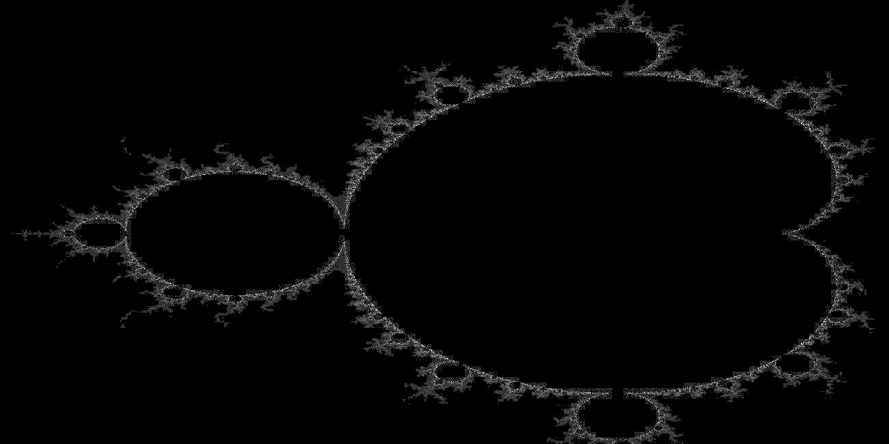

# Parallel Mandelbrot Set Computation and Rendering

Generates Mandelbrot set images in PGM format. The goal is to compare sequential and parallel implementations using MPI.

## Overview

This is a project meant to learn the basic features of MPI (Message Passing Interface).

MPI is a programming standard for distributed memory systems. It is designed to be used in programs that can exploit the existence of multiple processors.

The calculation and renderization of the Mandelbrot set is a perfect example of this, because the operations are independent from each other. 

The Mandelbrot set is a fractal defined on the complex plane. For each point `c`, the program evaluates the recursive sequence:

$$
z_{n+1} = z_n^2 + c,\quad z_0 = 0
$$

If the sequence remains bounded, the point is considered part of the set. Since this cannot be checked indefinitely in practice, the program uses a maximum number of iterations and an escape threshold, commonly `|z| > 2`, to decide whether the sequence diverges.

Each point of the complex plane is mapped to a pixel in the output image. The final grayscale value depends on how quickly the sequence diverges, allowing the fractal structure to be visualized.

The project also explores the computational cost of generating the Mandelbrot set and compares different execution strategies, including parallel implementations.

## Technologies used

- C/C++
- MPI
- GCC
- Make

## How it works

The first step is solving the problem using a sequential implementation. This first program receives the maximum iterations as an input. Step by step:  

1. It reserves memory for the image.
2. For each pixel:
	a. It is transformed into a point in the complex plane.
	b. It determines if that point belongs to the Mandelbrot set.
3. It measures the time required for that calculation.
4. It saves the PGM image. The grayscale value is chosen depending on the number of iterations required by the calculation.

From this sequential program, we obtain the parallel one, parallelizing the calculation part using MPI. This new parallel program follows these steps:

1. It initizalizes the MPI environment.
2. Then determines the local workload for each process. This specific implementation uses a cyclical allocation strategy. 
This is because the workload is not evenly distributed, since there are regions of the set with more points than others. 
The allocation works as follows: given a process `p`, the rows assigned to it are: `p`, `p + size`, `p + 2*size`, ...
3. It reserves local memory depending on the rows.
4. It performs the local calculation.
5. It sends the data size to process 0 (master).
6. It calculates the offsets, since rows do not arrive in order.
7. It reserves global memory.
8. It collects the local data.
9. Finally, the global image gets reconstructed, using the same concept as in step 2.

## Installation

To download and compile the project:

```bash
git clone https://github.com/LeviDooku/parallel-mandelbrot-set-calculus.git
cd parallel-mandelbrot-set-calculus
make 
```

The makefile is configured to do a bunch of things:

```bash
make compile_sec #Compile only sequential implementation
make compile_parallel #Compile only parallel implementation
make try_seq #Compile + test sequential implementation (5000 iterations)
make try_parallel #Compile + test parallel implementation (5000 iterations, 8 processes)
make benchmark #Try and compare different iterations and processes in each implementation
make clean
make clean_data
make clean_bin
make clean_img
```

## Examples

### Output

This is an example of an output of the program. The image contrast has been edited for better viewing.



### Performance results

These results were obtained from an Intel i7-1355U processor.

The following table shows the execution time comparison between the sequential implementation and the MPI implementation using different numbers of processes.

| Iterations | Sequential time (s) | MPI 2 processes (s) | Speedup 2p | MPI 4 processes (s) | Speedup 4p | MPI 6 processes (s) | Speedup 6p | MPI 8 processes (s) | Speedup 8p |
|---:|---:|---:|---:|---:|---:|---:|---:|---:|---:|
| 250 | 0.499562 | 0.261729 | 1.91x | 0.268858 | 1.86x | 0.236152 | 2.12x | 0.188359 | 2.65x |
| 500 | 0.968625 | 0.483396 | 2.00x | 0.507348 | 1.91x | 0.385956 | 2.51x | 0.305779 | 3.17x |
| 1000 | 1.822307 | 0.927623 | 1.96x | 0.979343 | 1.86x | 0.698530 | 2.61x | 0.541856 | 3.36x |
| 2000 | 3.645121 | 1.815029 | 2.01x | 1.915575 | 1.90x | 1.275459 | 2.86x | 1.014671 | 3.59x |
| 3000 | 5.376793 | 2.728001 | 1.97x | 2.853907 | 1.88x | 1.951394 | 2.76x | 1.483955 | 3.62x |
| 5000 | 8.946233 | 4.476264 | 2.00x | 4.729349 | 1.89x | 3.176996 | 2.82x | 2.422154 | 3.69x |
| 7500 | 13.380289 | 6.683995 | 2.00x | 7.075126 | 1.89x | 4.765086 | 2.81x | 3.594845 | 3.72x |
| 10000 | 17.806782 | 8.914924 | 2.00x | 9.420041 | 1.89x | 6.334595 | 2.81x | 4.802803 | 3.71x |
| 15000 | 26.750105 | 13.344259 | 2.00x | 14.114373 | 1.90x | 9.457971 | 2.83x | 7.110930 | 3.76x |
